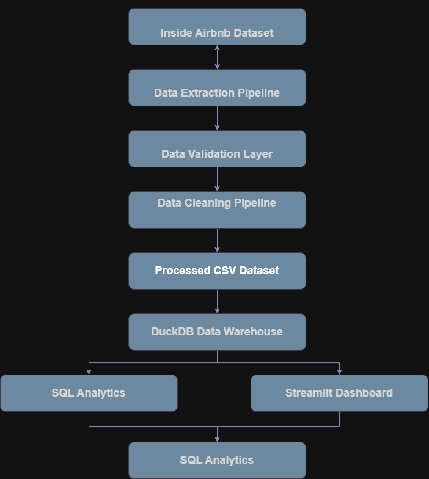

# Airbnb Data Engineering Pipeline & Market Intelligence Platform


## Overview

This project implements an end-to-end **Data Engineering and Analytics pipeline** for Airbnb market analysis.

The objective is to transform raw Airbnb listing data into a reliable analytics platform through:

- Automated data ingestion
- Data validation and quality assessment
- Data cleaning and standardization
- Analytical data warehouse creation
- SQL-based business analytics
- Exploratory data analysis
- Interactive dashboard development

The project demonstrates a complete modern analytics workflow, from raw data processing to business insights.

---

# Project Objectives

The main objectives of this project are:

1. Build a repeatable data ingestion pipeline.
2. Perform automated data profiling and quality checks.
3. Clean and transform raw Airbnb datasets.
4. Design an analytical data warehouse using dimensional modeling.
5. Generate business insights through SQL analytics and visualization.
6. Develop an interactive dashboard for market exploration.

---

# Project Architecture




The complete workflow:

```
Airbnb Raw Dataset
        |
        |
        v
Data Ingestion Pipeline
        |
        |
        v
Data Validation Layer
        |
        |
        v
Data Cleaning & Transformation
        |
        |
        v
Processed Analytical Dataset
        |
        |
        v
DuckDB Data Warehouse
        |
        |
        +----------------+
        |                |
        v                v
 SQL Analytics     Streamlit Dashboard
        |
        |
        v
Business Insights
```

---

# Technology Stack

## Programming

- Python
- SQL

## Data Processing

- Pandas
- NumPy

## Database & Analytics

- DuckDB
- SQL

## Visualization

- Matplotlib
- Plotly
- Streamlit

## Development Tools

- Git
- GitHub
- VS Code

---

# Dataset

## Source

Inside Airbnb Dataset

## Selected Market

New York City Airbnb Listings

The analysis focuses on a single city to provide deeper insights into:

- Pricing behaviour
- Property distribution
- Neighbourhood trends
- Host characteristics
- Availability patterns

---

# Project Structure

```
airbnb-data-engineering-pipeline/

│
├── data/
│   ├── raw/
│   ├── processed/
│   └── reports/
│
├── database/
│   └── airbnb.duckdb
│
├── images/
│   ├── architecture.png
│   └── charts/
│
├── report/
│
├── sql/
│   ├── create_star_schema.sql
│   └── business_queries.sql
│
├── src/
│   │
│   ├── ingestion/
│   │   ├── extract_data.py
│   │   └── check_files.py
│   │
│   ├── profiling/
│   │   └── profiler.py
│   │
│   ├── validation/
│   │   └── validate.py
│   │
│   ├── cleaning/
│   │   ├── clean_listings.py
│   │   └── cleaning_report.py
│   │
│   ├── warehouse/
│   │   ├── build_database.py
│   │   └── run_queries.py
│   │
│   └── dashboard/
│       └── app.py
│
├── requirements.txt
├── config.py
├── run_pipeline.py
└── README.md

```

---

# Data Engineering Pipeline

## 1. Data Ingestion

The ingestion pipeline:

- Validates required dataset availability
- Extracts compressed datasets
- Organizes raw data files

Implemented using:

```
src/ingestion/
```

---

# 2. Data Profiling

Automated profiling generates:

- Dataset dimensions
- Column data types
- Missing value percentages
- Unique value counts

Generated reports:

```
data/reports/
```

Example:

```
listings_profile.csv
```

---

# 3. Data Quality Validation

The validation layer checks:

## Completeness

- Missing values
- Null percentage analysis

## Accuracy

- Invalid prices
- Incorrect coordinates

## Consistency

- Duplicate records
- Invalid categorical values

## Outlier Detection

Price outliers are identified using the Interquartile Range (IQR) method.

---

# 4. Data Cleaning & Transformation

The cleaning pipeline performs:

## Price Standardization

Before:

```
"$250.00"
```

After:

```
250
```

---

## Missing Value Handling

Examples:

- Missing review frequency → 0
- Missing host information → Unknown

---

## Data Type Standardization

Converted:

- Date columns
- Numeric fields
- Categorical fields

Output:

```
data/processed/listings_clean.csv
```

---

# Data Warehouse Design

A DuckDB analytical warehouse was created using a star schema.

## Schema Design

```
                  dim_host
                      |
                      |
dim_room_type ---- fact_listings ---- dim_location

```

---

## Fact Table

### fact_listings

Contains measurable business metrics:

- Listing price
- Availability
- Reviews
- Ratings

---

## Dimension Tables

### dim_host

Contains:

- Host information
- Host experience
- Superhost status


### dim_location

Contains:

- Neighbourhood
- Latitude
- Longitude


### dim_room_type

Contains:

- Room categories

---

# SQL Analytics

The warehouse supports business-focused SQL analysis.

Examples:

## Average Price by Neighbourhood

```sql
SELECT

neighbourhood_cleansed,

AVG(price)

FROM fact_listings

GROUP BY neighbourhood_cleansed;

```

Business question:

> Which neighbourhoods have premium pricing?

---

## Room Type Distribution

```sql
SELECT

room_type,

COUNT(*)

FROM fact_listings

GROUP BY room_type;

```

Business question:

> What accommodation types dominate the market?

---

# Exploratory Data Analysis

EDA was performed to understand:

- Price distribution
- Room type popularity
- Neighbourhood pricing
- Review patterns
- Availability trends

---

## Key Insights

### Pricing

The Airbnb market shows a right-skewed price distribution, where most listings fall within affordable ranges while premium properties create higher price segments.

---

### Room Types

Entire home/apartment listings represent a significant portion of the market, indicating strong customer preference for private accommodation.

---

### Location Impact

Neighbourhood location strongly influences pricing, with premium areas achieving higher average nightly rates.

---

### Reviews

Most listings maintain strong review scores, indicating generally positive customer experiences.

---

# Interactive Dashboard

A Streamlit dashboard was developed for interactive exploration.

Features:

- Market overview KPIs
- Price analysis
- Room type comparison
- Neighbourhood pricing analysis
- Geographic listing visualization


## Dashboard Preview


---

# Running the Project

## 1. Clone Repository

```bash
git clone <repository-url>

cd airbnb-data-engineering-pipeline
```

---

## 2. Create Virtual Environment

```bash
python -m venv .venv
```

Activate:

Windows:

```bash
.venv\Scripts\activate
```

Linux/Mac:

```bash
source .venv/bin/activate
```

---

## 3. Install Dependencies

```bash
pip install -r requirements.txt
```

---

## 4. Run Data Pipeline

```bash
python run_pipeline.py
```

---

## 5. Run Dashboard

```bash
streamlit run src/dashboard/app.py
```

Dashboard available at:

```
http://localhost:8501
```

---

# Reproducibility

The project was designed as a repeatable pipeline.

A new user can:

1. Download the dataset
2. Place raw files in the required directory
3. Install dependencies
4. Execute the pipeline
5. Generate the warehouse and reports

---

# Future Improvements

Potential improvements:

- Deploy pipeline using cloud services
- Add workflow orchestration with Apache Airflow
- Implement automated testing
- Add machine learning based price prediction
- Add real-time Airbnb data ingestion
- Containerize application using Docker

---

# Author

**[YOUR NAME]**

Computer Engineering Graduate

Interested in:

- Data Engineering
- Artificial Intelligence
- Machine Learning
- Analytics Engineering


---

# License

This project is licensed under the MIT License.