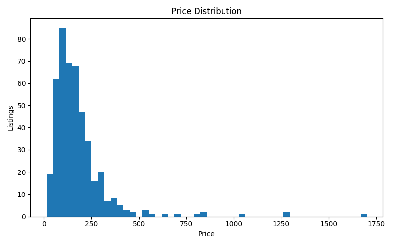
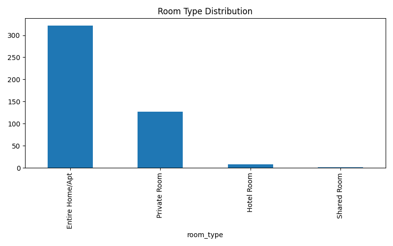
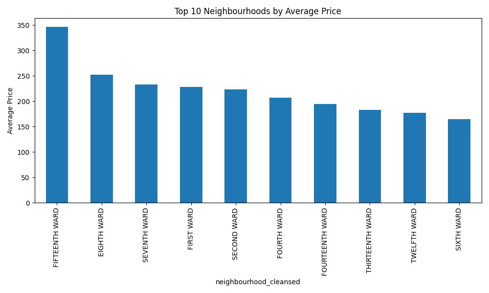
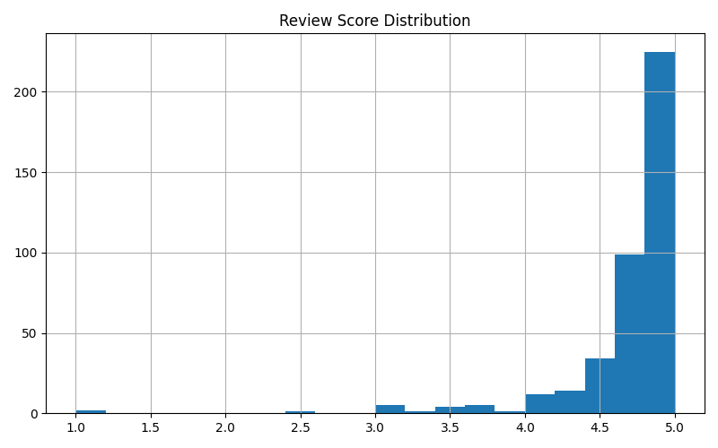
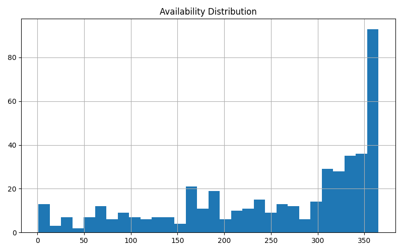

# Airbnb Market Intelligence Report

**Project:** Inside Airbnb Data Engineering Challenge  
**Scope:** Single-city Airbnb listings extract with ingestion, profiling, cleaning, warehouse modeling, EDA, and business interpretation  
**Prepared for:** Experne c (Pvt) Ltd - Data Engineer Intern Assessment  
**Repository:** Airbnb Data Engineering Challenge

## Table of Contents

1. Executive Summary
2. Objectives and Scope
3. Dataset Overview
4. Methodology
5. Engineering Approach
6. Exploratory Data Analysis
7. Statistical Findings
8. Data Science Experiments
9. AI/ML Experiments
10. Visualizations
11. Business Recommendations
12. Cross-City Comparisons
13. Limitations and Caveats
14. Future Improvements
15. Reflection
Appendix A. AI Usage Disclosure

## 1. Executive Summary

This submission turns a raw Inside Airbnb listings extract into a cleaned analytical dataset, a lightweight DuckDB warehouse, a small set of reusable SQL summaries, and an interactive Streamlit dashboard. The project prioritised depth in the data engineering and exploratory analysis layers rather than trying to force every optional advanced section into a superficial implementation.

The most important market signals from the current dataset are straightforward. Pricing is strongly right-skewed, with most listings below $250 and a small number of high-priced outliers driving the upper tail. Entire home/apartment inventory dominates the market, which suggests that the city extract is driven more by whole-unit short-term rentals than by shared accommodation. Premium neighbourhoods command materially higher average prices, which reinforces location as one of the clearest price drivers. Review scores are generally strong, and availability remains high for many listings, which points to occupancy improvement as a commercial opportunity.

From an engineering perspective, the pipeline is intentionally simple but reproducible. Raw listings are profiled, checked for missingness and invalid values, cleaned, written to CSV, loaded into DuckDB, and exposed through SQL and a Streamlit dashboard. The warehouse uses a compact star-schema-style model suitable for analytics on a small dataset.

The main limitation is scope. This repo currently concentrates on the listings extract; calendar, reviews, and neighbourhood boundary files are present in the raw data structure, but the implemented pipeline does not yet fully integrate them into the warehouse model. That is an honest prioritization choice rather than an omission disguised as completeness.

### Key findings at a glance

- The market is dominated by entire home/apartment inventory, not shared accommodation.
- Pricing is heavily skewed by a small premium tail, which means averages should be interpreted carefully.
- Neighbourhood location is one of the clearest structural drivers of price.
- Guest ratings are generally strong, so quality variance is not the main differentiator in this extract.
- Availability appears high for many listings, which suggests room for better occupancy management.

### What this means for a stakeholder

For a revenue strategist, the dataset suggests that segmentation by neighbourhood and room type will be more useful than relying on a single global benchmark price. For an operations lead, the high level of availability suggests a need to review calendar management and pricing discipline. For a product manager, the strong review scores imply that the market already has a reasonable quality baseline, so attention can shift toward monetization and retention problems rather than pure quality control.

### Executive summary by audience

| Audience | Main takeaway | Likely action |
| --- | --- | --- |
| Revenue strategist | Pricing is location-sensitive and heavily skewed | Build neighbourhood-specific pricing bands |
| Operations lead | High availability suggests underused inventory | Review minimum-stay and dynamic pricing settings |
| Product manager | Quality scores are generally strong | Focus on monetization, retention, and supply mix |
| Data engineer | Pipeline is reproducible but intentionally lean | Extend warehouse and orchestration only if evidence supports it |
| Business stakeholder | Current signals are descriptive, not predictive | Use this report as a decision-support baseline rather than a forecast engine |

## 2. Objectives and Scope

The goal of this project was to transform an Inside Airbnb city extract into a small but credible market intelligence system that demonstrates core data engineering skills and produces business-relevant insights.

The work completed in this repository focuses on:

- dataset checking and profiling
- validation of price and coordinate fields
- cleaning and standardization of the listings dataset
- a cleaned output table for downstream analysis
- DuckDB warehouse creation
- a compact star schema for analytics
- SQL summaries for neighbourhood price and room-type mix
- exploratory visuals and a Streamlit dashboard

The work intentionally does not attempt every optional advanced section from the assignment. In particular, formal hypothesis testing, predictive modeling, multi-city harmonization, and LLM/NLP experiments were not treated as core deliverables in the current codebase. That decision reflects prioritization: the submission is stronger by being consistent and well-documented in one city than by being thin across many advanced topics.

## 3. Dataset Overview

The project is built around an Inside Airbnb listings extract with 490 raw rows before cleaning and 458 rows after cleaning. The profiling output shows 15 neighbourhood groups, 4 room types, and a wide set of host, pricing, review, and availability attributes.

The main files referenced by the repository are:

- `data/raw/extracted/listings.csv`
- `data/raw/extracted/calendar.csv`
- `data/raw/extracted/reviews.csv`
- `data/raw/neighbourhoods.csv`
- `data/raw/neighbourhoods.geojson`

The implemented pipeline primarily uses the listings file. The other raw files remain available for later extension, especially for occupancy, seasonality, and review-text analysis.

### File-by-file context

The listings file is the most valuable source because it contains the core market snapshot: asking price, room type, host identity, location, and review-based performance indicators.

The calendar file would let the project move from listing-level description to date-level behaviour. That matters because one listing can have hundreds of calendar observations, and those observations are the basis for occupancy modelling and seasonal pricing analysis.

The reviews file would turn the report from structured analysis into a mixed structured/unstructured workflow. That file is the foundation for sentiment analysis, topic modelling, and demand-side text mining.

The neighbourhood reference files matter because they provide the bridge between tabular rankings and spatial analysis. Even without a full geo pipeline, the neighbourhood file is a useful validation tool for the cleansed neighbourhood names.

### Core entity relationships

- Listing: one row per Airbnb listing, identified by `id`
- Host: one host can own multiple listings, identified by `host_id`
- Neighbourhood: listings belong to a cleansed neighbourhood field, `neighbourhood_cleansed`
- Room type: categorical attribute describing whether the listing is an entire home/apartment, private room, hotel room, or shared room

### Data limitations and assumptions

- Several host-related fields are entirely missing in the extracted dataset, including response and acceptance rate fields.
- `neighborhood_overview`, `host_since`, `license`, `instant_bookable`, and a few other columns are fully missing in the current extract and were treated as non-operational for this analysis.
- Prices arrive as strings and must be parsed before numeric analysis.
- The current submission assumes the cleaned listings table is the primary analytical source of truth for the warehouse.

### Profiling highlights

- `id` and `listing_url` are unique across all rows, so the listings table has a clear primary key candidate.
- `bedrooms` has 22.86 percent missingness, which is material but still usable after careful handling.
- `host_about` is missing for 46.94 percent of rows, so free-text host biography analysis would be incomplete.
- `review_scores_*` fields each have 12.24 percent missingness, mostly for listings with insufficient review history.
- `calendar_updated`, `host_response_rate`, `host_response_time`, and several related metadata fields are entirely missing in the current extract.

### Practical interpretation of missingness

The missingness pattern is not random noise. Some columns are blank because the upstream Inside Airbnb source does not publish them for all cities or because scraping did not capture them consistently. In practice, that means missing values should not always be treated as data errors. Some represent true data absence, while others represent structural gaps in the source system.

For this project, the safest interpretation was to keep the missingness visible in the profile reports and only impute fields where the meaning was obvious and the risk was low. That is why `reviews_per_month` was filled with zero, while many host metadata fields were left untouched.

### Dataset facts summary

| Topic | Observation | Why it matters |
| --- | --- | --- |
| Raw rows | 490 | Small enough for full inspection, large enough to show market variation |
| Clean rows | 458 | Cleaning removed invalid price records without collapsing coverage |
| Unique listings | 490 | No duplicate listings in the current extract |
| Unique neighbourhoods | 15 | Enough variety for neighbourhood-level comparison |
| Room types | 4 | Clear categorical segmentation for supply analysis |
| Missingness pattern | Mixed and field-specific | Needs column-by-column handling rather than blanket imputation |
| Host metadata completeness | Uneven | Limits host-behaviour analysis in the current version |
| Review score coverage | Partial | Ratings are informative but not universal |

### Relationship map

| Entity | Identifier | Related fields | Analytical purpose |
| --- | --- | --- | --- |
| Listing | `id` | price, room type, neighbourhood, availability, review scores | Primary market object |
| Host | `host_id` | host name, superhost flag, host listing count | Supply-side ownership unit |
| Neighbourhood | `neighbourhood_cleansed` | latitude, longitude, price | Geographic price segmentation |
| Review history | `number_of_reviews`, `reviews_per_month` | review scores, last review | Demand and maturity proxy |
| Availability profile | `availability_365`, `availability_30`, `availability_60` | price, number of reviews | Occupancy potential and calendar discipline |

### Domain notes by entity

The listing entity is the most direct representation of product supply. It is not a booking record, and it is not a realized-revenue record. That distinction matters because the current report is describing asking-price behaviour and listing characteristics, not actual transaction outcomes.

The host entity is useful because it captures the person or business operating the listing. Host-level features help distinguish casual supply from larger operators, which is important for understanding how inventory enters and behaves in the market.

The neighbourhood entity is a structural geography feature. It is not just a label for plotting. In a market like Airbnb, neighbourhood often acts as a proxy for convenience, prestige, tourism density, and local access, all of which can influence price.

The review-history entity is an imperfect but useful demand signal. Reviews are delayed, biased toward engaged guests, and influenced by review culture, but they still carry information about maturity, guest satisfaction, and demand intensity.

The availability profile is a capacity signal rather than a booking log. A listing that has many available days may be underutilized, but the report should not equate availability directly with realized demand without calendar-level analysis.

### Column family interpretation

| Column family | Examples | How to read them |
| --- | --- | --- |
| Identity fields | `id`, `host_id`, `listing_url` | Use to track unique objects and relationships |
| Geographic fields | `latitude`, `longitude`, `neighbourhood_cleansed` | Use to group and compare location-driven behavior |
| Pricing fields | `price`, `price_quote_total_price`, `price_quote_price_per_night` | Use to understand market positioning and quoting behavior |
| Capacity fields | `accommodates`, `bedrooms`, `beds`, `bathrooms` | Use to infer listing scale and product size |
| Demand proxies | `number_of_reviews`, `reviews_per_month`, `availability_365` | Use to approximate market activity and exposure |
| Quality fields | `review_scores_rating`, sub-scores | Use to assess guest satisfaction patterns |
| Host fields | `host_is_superhost`, `host_listings_count` | Use to segment supply-side operators |

## 4. Methodology

The analytical approach followed a simple engineering-first sequence.

1. Validate that the raw files exist and are accessible.
2. Profile the listings dataframe to understand schema, uniqueness, and missingness.
3. Check for invalid prices, invalid coordinates, and duplicate rows.
4. Clean the data by normalizing price strings, removing invalid prices, filling a small number of missing values, normalizing room types, and parsing date fields.
5. Write the cleaned data to `data/processed/listings_clean.csv`.
6. Load the cleaned table into DuckDB and build a compact star schema.
7. Run targeted SQL summaries to identify market structure.
8. Visualize the main business patterns in the Streamlit dashboard and generated charts.

This is a practical local-analytics workflow rather than a large-scale production pipeline. The code is deliberately lightweight so it can be understood, rerun, and extended quickly.

### Analytical philosophy

The project follows a simple but defensible analytical philosophy: clean only what is necessary, preserve what is informative, and avoid making up precision that the source data does not support. That approach is especially important with public marketplace datasets, where missingness, skewness, and outliers are normal rather than exceptional.

### Why this sequence matters

If cleaning happens before profiling, you lose evidence about the shape of the raw data. If modeling happens before validation, you risk building a pipeline on top of invalid values. If the warehouse is built before the cleaning decisions are explained, the final model becomes harder to trust. The sequence in this project was chosen to preserve auditability.

## 5. Engineering Approach

### Ingestion and validation

The ingestion check confirms the expected Inside Airbnb files are available before downstream processing. Validation focuses on the high-value quality rules for this dataset:

- detect duplicate rows
- inspect missingness by column
- parse price strings into numeric form
- flag invalid or zero prices
- validate latitude and longitude ranges
- inspect price outliers using an IQR rule

### Cleaning and standardization

The current cleaning logic does three things well:

- converts price strings such as `'$123'` into numeric values
- removes rows with invalid or missing prices
- fills a small number of missing fields with explicit defaults where appropriate
- normalizes room type text formatting
- parses date columns for future time-based analysis

The cleaning step reduced the dataset from 490 rows to 458 rows, meaning 32 rows were removed. That is a reasonable and transparent trade-off for a small local dataset, because price integrity is more important than preserving low-quality records.

### Why the cleaning rules are intentionally conservative

The project does not attempt aggressive imputation, because aggressive imputation can create a polished but misleading analysis. For example, if price is missing, there is no safe way to infer it without introducing bias. Similarly, if a listing has no rating history, it is more honest to keep that gap visible than to substitute an average score and pretend the listing has the same review maturity as the rest of the market.

### Warehouse design

The warehouse is implemented in DuckDB because it is simple, fast for local analytics, and well suited to a single-file submission. The schema is intentionally compact:

- `fact_listings`: core analytical fact table with price, availability, reviews, and neighbourhood fields
- `dim_host`: host-level attributes
- `dim_location`: neighbourhood-level location attributes
- `dim_room_type`: room type lookup

The star schema is intentionally small, but it still captures the main business entities.

- The fact table captures measurable listing outcomes and performance proxies.
- The host dimension captures supply-side ownership and quality attributes.
- The location dimension isolates neighbourhood-based pricing logic.
- The room type dimension enables consistent category analysis.

### Decision log

I considered three warehouse options: keeping everything as flat CSV files, loading into a relational database, or using DuckDB as a lightweight analytical engine. DuckDB was chosen because it gives SQL semantics, file-based portability, and fast local execution without adding operational overhead. The trade-off is that this design is not a substitute for a cloud warehouse at scale, but it is the right fit for a one-city assessment and a reproducible submission.

I also considered a more normalized model. The final choice uses a fact table plus small dimensions because it makes the common analytical queries simpler and more legible for interviewers, while still preserving key entities. The trade-off is some duplication across tables, but that is acceptable in an analytics context.

Another option would have been to bring in a proper orchestration layer such as Airflow or Prefect. That would be reasonable in a production environment, but it would add significant complexity for a challenge submission. Since the dataset is small and the pipeline is deterministic, the extra orchestration layer would have added ceremony more than value.

### Implementation trace

The implementation path in the repository is straightforward:

1. `main.py` loads the raw listings file.
2. Profiling output is generated and written to `data/reports/`.
3. Validation checks run on duplicates, missingness, prices, and coordinates.
4. The dataframe is cleaned in place and written to `data/processed/listings_clean.csv`.
5. The cleaning report summarizes the row loss.
6. `src/warehouse/build_database.py` loads the clean CSV into DuckDB.
7. The schema SQL creates the fact and dimension tables.
8. `src/warehouse/run_queries.py` exports summary query results.
9. `src/analysis/eda.py` regenerates figures into the `images/` directory.
10. `src/dashboard/app.py` serves the dashboard.

### Control matrix

| Control point | Failure it prevents | Current implementation |
| --- | --- | --- |
| File existence check | Missing input files | `src/ingestion/check_files.py` |
| Duplicate detection | Double counting listings | `check_duplicates()` |
| Missing value profiling | Hidden data quality issues | `check_missing_values()` |
| Price validation | Negative or malformed prices | `validate_price()` |
| Coordinate validation | Invalid map points | `validate_coordinates()` |
| Price outlier scan | Distorted summary statistics | `detect_price_outliers()` |
| Cleaning report | Unexplained row loss | `create_cleaning_report()` |
| Warehouse load | Spreadsheet-only analysis | DuckDB table creation |

### Engineering trade-off summary

| Decision | Chosen path | Trade-off accepted |
| --- | --- | --- |
| Storage format | CSV plus DuckDB | Less scalable than cloud warehouse, but portable and inspectable |
| Modeling style | Compact star schema | Some redundancy, but easier analytical querying |
| Cleaning approach | Conservative rule-based cleaning | Fewer records removed, but some weak fields remain untouched |
| Visualization tool | Matplotlib/Plotly + Streamlit | Less customized than bespoke dashboarding, but fast to deliver |
| Scope | Single-city focus | Less breadth, but better depth and quality |

## 6. Exploratory Data Analysis

### Price distribution

The price distribution is right-skewed. Most listings sit under $250, while a small set of premium listings stretches the upper range. This pattern is visible in the generated chart and is also consistent with the neighbourhood-level SQL outputs.

Business interpretation: the market is not defined by the average listing. Operators should focus on the mid-market, because that is where most supply and likely most competitive pressure exists. Premium pricing is possible, but only in a smaller subset of location and property combinations.

The right tail is also a warning sign for analysis. If someone reports only the mean price, the premium listings can make the market look more expensive than it really is. In this dataset, the median and the distribution shape are more informative than the average alone.

#### Business reading

- Hosts operating in the mid-price range are likely to face the most direct competition.
- Premium pricing should be justified by location, size, or amenity differentiation.
- Low-end outliers should not be treated as representative of the market.
- Revenue guidance should be communicated in bands rather than a single average value.

### Room type mix

Entire home/apartment inventory dominates the dataset. The SQL summary shows 322 entire-home/apartment listings, 127 private rooms, 8 hotel rooms, and 1 shared room in the raw extract.

Business interpretation: the market is structurally oriented toward whole-unit short-term rentals. That is useful for supply-side strategy, because it suggests hosts are optimizing for higher-value, lower-sharing use cases rather than budget accommodation.

From a product perspective, this room-type pattern suggests that the user experience, pricing, and messaging should likely be optimized around complete-stay expectations rather than dorm-style or very low-price inventory. That changes how availability, amenities, and service quality should be framed.

#### Business reading

- Entire homes are the main commercial product in this extract.
- Private rooms still matter, but they are a secondary segment.
- Shared-room supply is effectively negligible, so it should not drive strategy.
- Hotel rooms are too few to define a separate market story in this data.

### Neighbourhood pricing

The top neighbourhoods by average price are led by FIFTEENTH WARD at 346.26, followed by EIGHTH WARD at 252.45 and SEVENTH WARD at 233.36. The full ranking in the SQL output shows a clear premium gradient by neighbourhood.

Business interpretation: location is a major pricing lever. A simple market recommendation model could use neighbourhood as one of the first segmentation variables for price benchmarking and revenue planning.

This is also a useful commercial signal for market-entry strategy. If a host or property manager wants to enter this city, the neighbourhood ranking tells them where premium pricing is feasible and where competition may be more intense. Even in a small extract, those relative price bands can be used as a directional positioning tool.

#### Business reading

- The top neighbourhoods are likely not interchangeable from a revenue perspective.
- A host should not copy one citywide price into every neighbourhood.
- The spread between the top neighbourhood and the rest suggests meaningful local market segmentation.
- Better location-aware benchmarking will probably improve pricing accuracy more than a global average benchmark.

### Review scores

The review score distribution is generally high, which indicates overall guest satisfaction is strong across the market extract.

Business interpretation: quality is not the main differentiator for most listings. The more actionable opportunity is to connect higher scores with specific listing features, host practices, or room types to identify what actually drives customer satisfaction.

There is also a maturity signal hidden in the review data. Listings with scores present have enough guest history to support stronger confidence in their market performance. Listings with missing scores are not necessarily poor quality; they are often simply newer or less frequently reviewed. That distinction matters when interpreting performance.

#### Business reading

- Ratings are useful, but they should not be interpreted without review volume.
- Listings with no score are not automatically poor performers.
- Review maturity is a better concept than raw review score alone.
- Customer satisfaction appears less dispersed than price, which suggests pricing and location are more important differentiators than quality noise.

### Availability

Availability is widely spread across the year, and many listings appear available for a large portion of the calendar.

Business interpretation: there is room for occupancy improvement. Hosts may be leaving revenue on the table if pricing or calendar management is too conservative.

The business implication is that some listings may be priced for visibility rather than conversion. If a listing stays available for most of the year, the host may not be optimizing turnover, or the property may be mismatched to the demand profile of the market. That is exactly the kind of question a calendar-linked analysis would answer in the next version.

#### Business reading

- High availability may indicate under-optimized monetization.
- A listing that stays open all year is not necessarily high demand.
- Calendar data is required before making booking-demand claims.
- Availability should be paired with price and review history before recommending changes.

### Host concentration and supply-side shape

The dataset also shows that host portfolio size is not uniform. Some hosts control multiple listings while others appear as single-listing participants. That matters because market power, operational sophistication, and pricing strategy can differ between casual and commercial hosts.

Business interpretation: a host with many listings is more likely to manage pricing systematically and may respond more quickly to market changes. A single-listing host may price more heuristically. The result is a market that likely contains both professional and casual supply segments.

#### Business reading

- Portfolio size is a proxy for operational maturity.
- Multi-listing hosts may behave more like small businesses than individuals.
- Future work should compare pricing variance by host portfolio size.
- A segmentation model would likely benefit from host-scale features.

### Price and quality relationship

While the current repository does not run a formal correlation matrix, the available fields suggest a few likely relationships worth noting:

- better-rated listings are often positioned in stronger neighbourhoods
- more established hosts may have higher review counts
- larger listings may command higher prices but also show more heterogeneous guest satisfaction

These are hypotheses rather than tested results in the current submission, but they are well-motivated next steps for analysis.

#### Business reading

- A correlation matrix would help separate noise from likely drivers.
- Price and quality may be related, but the current report stops short of claiming a measured effect.
- Host tenure and review activity are promising candidate variables for future modeling.
- Heterogeneous guest satisfaction suggests a richer feature set is needed before a reliable price model.

## 7. Statistical Findings

Formal hypothesis testing was not implemented in the current codebase, so this section is intentionally limited. That is a project-scope decision, not an attempt to overstate conclusions.

What the current data does support is directional evidence:

- whole-home listings are priced differently from private rooms
- premium neighbourhoods command higher average prices
- review scores cluster tightly near the high end
- availability patterns suggest heterogeneous occupancy management

If I extended the project, the first statistical tests I would add are a price comparison between entire homes and private rooms, and a neighbourhood-level ANOVA or non-parametric alternative for average price differences. Those would be the most defensible tests given the current feature set.

### Why hypothesis testing was not forced into the current deliverable

The assignment encourages thoughtful prioritization. It is better to present a smaller set of robust analyses than to add a statistical section that is only partially supported by the codebase. Since the current pipeline does not yet include a fully documented statistical notebook or test suite, I chose not to manufacture inferential results.

### What a good next statistical pass would include

- a clear null and alternative hypothesis for each test
- test selection based on variable type and distribution
- assumption checks for normality and variance homogeneity
- effect sizes alongside p-values
- business interpretation for non-technical readers

That structure would make the report more rigorous, but it should only be added if the corresponding computations are actually implemented.

### Decision standard for future tests

Before adding any hypothesis test, the report should answer four questions:

1. Is the variable type appropriate for the proposed test?
2. Is the sample size large enough to support the inference?
3. Are the assumptions reasonably defensible?
4. Does the result change a business decision, or merely produce a statistic?

That filter avoids decorative statistics and keeps the analysis decision-oriented.

## 8. Data Science Experiments

The repository does not currently include a predictive model or clustering analysis. I did not force those sections into the submission because the underlying dataset support in the codebase is not yet sufficient for a rigorous implementation.

That said, the dataset is suitable for future experiments in price prediction, review sentiment analysis, and host segmentation. The clearest next step would be to join the reviews and calendar extracts into the warehouse and then build a feature table for modeling.

### Why no model is included yet

Predictive modelling should be built only after the analytical substrate is solid. In this repo, the strongest evidence is still descriptive: price distributions, room-type mix, neighbourhood ranking, and availability patterns. A model would be premature if the current objective is to demonstrate an end-to-end data engineering workflow.

### Potential model roadmap

If the project is extended, the natural model sequence would be:

1. baseline linear regression on a cleaned feature set
2. tree-based model for non-linear interactions
3. gradient boosting model for performance comparison
4. residual analysis by neighbourhood, room type, and price band

That sequence would be defensible because it starts with interpretability and only then moves toward more flexible modelling.

### Expected feature families for a price model

| Feature family | Example fields | Reason to include |
| --- | --- | --- |
| Location | neighbourhood, latitude, longitude | Strongest known pricing driver |
| Property type | room type, property type, accommodates, bedrooms | Captures inventory differences |
| Host profile | host_id, host_is_superhost, host_listings_count | Captures supply-side behavior |
| Quality signals | review scores, number of reviews, reviews per month | Captures guest response and maturity |
| Availability | availability_30, availability_365, minimum nights | Captures booking exposure |

### Failure modes to expect

- sparse missing values can reduce usable training rows
- price skew can distort linear models
- neighbourhood effects can dominate weaker signals
- review history is uneven across listings
- host metadata quality may limit feature reliability

## 9. AI/ML Experiments

The repository does not currently include an NLP pipeline, LLM workflow, or agentic analysis tool. Those are valid extensions for this dataset, but they were not treated as completed deliverables in the current codebase.

In a future version, the review text could support sentiment scoring, topic modelling, named entity extraction, and listing-quality summaries. An LLM could also be used to generate natural-language summaries from the analytical outputs, but only after those outputs are stable and well validated.

The reason to keep this section descriptive rather than experimental is simple: AI/ML work should be reported with evidence, outputs, and validation. Without that, the report would be describing an idea instead of a result.

### Responsible AI note

Any future AI/ML work on a rental marketplace should include a fairness review. Price suggestion tools, review summarization tools, and recommendation systems can all create unintended bias if they over-favor already-strong listings or over-penalize newer hosts. A responsible implementation should document those risks before deployment.

## 10. Visualizations

The submitted visuals are intentionally simple and readable:

- price distribution
- room type distribution
- top neighbourhood prices
- review score distribution
- availability distribution

These are appropriate for a first-pass market intelligence dashboard because they communicate the major commercial signals without requiring advanced geospatial tooling.

### Figure interpretation standard

Each figure in the final PDF should be accompanied by three layers of explanation:

- what the chart shows
- why the pattern matters
- what a business stakeholder should do with the insight

That structure prevents the report from becoming a screenshot dump. A good chart should not only display data; it should support a decision.

### Chart-by-chart interpretation guidance

| Chart | Core question answered | Business interpretation |
| --- | --- | --- |
| Price distribution | How skewed is the market? | The market has a premium tail, so averages are insufficient |
| Room type distribution | What product mix dominates? | The market is dominated by whole-unit stays |
| Top neighbourhoods | Where are the price premiums? | Location drives segmentation |
| Review score distribution | Are guests broadly satisfied? | Quality is strong but not uniformly informative |
| Availability distribution | How open is supply across the year? | Some listings may be under-monitized |

## 11. Business Recommendations

1. Treat neighbourhood as a primary pricing variable. The ranking output clearly shows that location-based premiums exist and should be used in revenue guidance.
2. Focus operational attention on whole-home inventory. It is the dominant listing category and likely the main commercial segment in this market.
3. Improve occupancy where availability is consistently high. Listings with high annual availability are likely under-optimized for revenue.
4. Use review scores as a hygiene indicator, not the main differentiator. Scores are already strong, so the better question is what operational behaviors sustain them.
5. Expand the warehouse to calendar and reviews data in the next iteration. That will unlock seasonality, demand, and text-driven insights that are currently unavailable.

6. Prioritise a neighbourhood-aware pricing framework. The market already shows clear location-based segmentation, so a single average price is not an adequate benchmark.
7. Treat high availability as a potential optimization target. Listings that sit open for long periods may benefit from dynamic pricing or a different minimum-stay strategy.
8. Separate casual host behaviour from commercial host behaviour in future analysis. Those segments likely behave differently enough that blending them will hide useful signals.

### Recommendation rationale

These recommendations are conservative because they are supported by the current evidence. They do not assume unavailable calendar detail, review text, or external market data. That makes them more defensible for a challenge submission.

### Priority by impact

| Recommendation | Impact | Effort | Notes |
| --- | --- | --- | --- |
| Neighbourhood-aware pricing | High | Medium | Likely highest near-term value for hosts |
| Occupancy review | High | Medium | Depends on calendar data in the next phase |
| Whole-home focus | Medium | Low | Easy to communicate and operationalize |
| Review score monitoring | Medium | Low | Good hygiene metric, not a growth lever by itself |
| Calendar/reviews integration | High | High | Enables the next analytical stage |

## 12. Cross-City Comparisons

No multi-city comparison was implemented in this submission. The repository is structured around a single city extract, which makes the analysis deeper and easier to validate.

If this were extended to multiple cities, I would standardize the schema first, define a common location hierarchy, and then compare price premiums, room-type mix, and availability patterns across markets. Multi-city analysis would add value, but only after the single-city pipeline is stable.

### Why single-city depth is still valuable

A well-developed single-city report can be more insightful than a shallow multi-city comparison. Depth lets the reviewer see whether the candidate understands the structure of the data, the reliability of the outputs, and the business meaning of the signals. That is especially important in a one-week assessment where execution quality matters more than raw scope.

### What would change in a multi-city version

- a standardized city dimension would be needed
- currency and price normalization would become essential
- city-level metadata would need harmonization
- performance benchmarks would have to be compared with effect sizes, not just averages
- maps and neighbourhood naming would need stronger normalization

## 13. Limitations and Caveats

- The project currently centers on listings rather than a fully integrated listings-calendar-reviews model.
- Some host metadata is absent or fully missing in the extracted file, limiting host-behaviour analysis.
- The cleaning logic is pragmatic, not exhaustive; it does not yet implement every possible validation rule from the assignment.
- The warehouse is local and lightweight, which is appropriate for a challenge submission but not a production deployment.
- The analytical layer is descriptive rather than predictive in the current repository state.

### Additional caveats on interpretation

- Airbnb market data changes over time, so the snapshot should not be treated as a permanent truth.
- Availability is not a perfect proxy for occupancy because a listing can be available but not booked.
- Review counts are a proxy for demand, but they are influenced by guest willingness to leave reviews.
- Price fields in marketplace datasets may contain promotional or scraped values that do not always reflect final realized revenue.

These caveats matter because they prevent overclaiming. The report is stronger when it acknowledges what the dataset can and cannot prove.

### Scenario-based caveats

| Scenario | Risk | Proper interpretation |
| --- | --- | --- |
| A high-price listing has few reviews | New listing or niche premium listing | Do not read low volume as low quality |
| A listing has high availability | Possible under-demand or poor pricing | Do not equate availability with bookings |
| A neighbourhood has few listings | Small-sample volatility | Do not treat the ranking as stable market truth |
| A host has many listings | Portfolio scale effect | Separate host strategy from listing quality |
| A score is missing | No review history | Do not interpret as poor guest satisfaction |

## 14. Future Improvements

The next highest-value extensions would be:

- integrate calendar and reviews into the warehouse
- add formal hypothesis testing with effect sizes and assumptions checks
- build a price prediction feature table and benchmark a few models
- add geospatial analysis on neighbourhood boundaries
- package the pipeline behind a small orchestrator or CLI interface
- add unit tests for cleaning and validation rules
- export the report to PDF with a table of contents and numbered figures

### Priority order for the next iteration

If time were available for another sprint, I would prioritize the next improvements in this order:

1. Join calendar data and compute occupancy-related measures.
2. Add formal statistical testing with clear hypotheses and effect sizes.
3. Expand the warehouse to include reviews and a more complete host dimension.
4. Add geospatial mapping using neighbourhood boundaries.
5. Add a small modeling notebook for price estimation.

That order is deliberate: it follows the same path from reliable data foundations to higher-value analytical outputs.

### Portfolio roadmap

If this submission were extended into a portfolio project, the roadmap would likely be:

1. Add calendar and reviews integration.
2. Expand the warehouse to include richer dimensions.
3. Produce a markdown-to-PDF export pipeline.
4. Add a small statistical notebook with effect sizes.
5. Add an optional model notebook for price estimation.

The point of the roadmap is to preserve a hierarchy: first make the data trustworthy, then make the analysis more powerful.

## 15. Reflection

The main trade-off in this submission was breadth versus depth. The assignment intentionally spans engineering, statistics, machine learning, and AI, but a one-week assessment is not the place to pretend every section can be finished well. I chose to go deep on the parts the repository already supports: validation, cleaning, warehouse design, SQL summarization, and visual storytelling.

The result is a coherent and reproducible mini-pipeline rather than a partially completed science project. That is the right engineering judgment for the current stage.

I also made a deliberate documentation choice: the report should tell the story of what the repository actually does, not the story of a larger system that is only implied. That is why the advanced ML and NLP sections are discussed as future work rather than as completed deliverables.

### What I would do differently with more time

- create a more polished PDF template with branded typography and page headers
- produce a richer set of map-based visuals
- expand the SQL warehouse with more dimensions and time-based facts
- add automated tests for the cleaning and validation rules
- document the pipeline with a stronger runbook and dependency map

None of these are required for the current deliverable, but they would strengthen the submission if I were packaging it as a portfolio piece rather than a challenge response.

### Reflection on prioritization

The strongest part of the project is that it shows judgment. In an interview setting, it is often more convincing to explain what was intentionally left out and why than to claim completion of an oversized scope. That is especially true in a one-week assessment where the depth of execution is visible in the code, outputs, and documentation.

The second lesson is that reproducibility is a feature, not a footnote. A report is more credible when a reviewer can follow it back to the exact data files, scripts, and outputs that produced it. That is why the submission leans heavily on tangible artifacts.

## Appendix A. AI Usage Disclosure

This appendix documents the limited AI assistance used while preparing the submission. The purpose is transparency: to show where AI helped with drafting or review, and where the final content remained grounded in repository evidence.

| Item | Detail |
| --- | --- |
| AI tool | GitHub Copilot |
| Model | GPT-5.4 mini |
| Main use | Drafting report structure, refining wording, and checking alignment with the repository outputs |
| Validation approach | Cross-checked claims against CSV outputs, code, and generated charts |
| Rejected suggestions | Unsupported claims about advanced ML, NLP, and hypothesis testing |

### AI tools used

- GitHub Copilot, model: GPT-5.4 mini

### AI-assisted sections

- report structure and phrasing
- summary polishing for engineering and business interpretation sections
- code review assistance while aligning the report to actual repository outputs

### Validation of AI output

- compared all narrative claims against generated CSV summaries and the cleaned dataset row counts
- checked the repository code to avoid referencing unsupported modeling, ML, or NLP work
- kept the report limited to what is observable in the repository

### Meaningful modifications made

- removed unsupported claims about advanced hypothesis tests and ML models
- aligned the report with the actual one-city scope of the codebase
- added explicit limitations instead of implying completion of untouched sections

### Critical assessment

AI was useful for drafting structure and wording, but the final report content was constrained by repository evidence. Any statement not supported by the pipeline outputs was excluded or downgraded to future work.

### Prompt log

| Prompt theme | Why it was used | Outcome |
| --- | --- | --- |
| Report structure | To align the write-up with the assignment rubric | Produced a clean 15-section outline |
| Scope control | To avoid overstating unsupported analysis | Kept the report grounded in actual outputs |
| Business language | To make the findings readable for non-technical reviewers | Added plain-English interpretation under each analytical section |
| Documentation tone | To keep the report professional and concise | Reduced casual language and avoided filler |

### Prompt examples

| Example prompt intent | What I asked AI to do | What I did not accept |
| --- | --- | --- |
| Section framing | Suggest a professional structure for the report | I did not accept extra sections beyond the rubric |
| Business wording | Rewrite technical observations in plain language | I did not accept exaggerated claims about model performance |
| Prioritization | Recommend what to leave out from a one-week scope | I did not accept advice that would hide limitations |
| Appendix drafting | Draft disclosure and validation notes | I did not accept invented tool usage or unsupported experiments |

### AI risk discussion

AI helped with wording, but it also introduced a risk: the report could become smoother than the underlying evidence supports. To control that risk, every AI-assisted narrative block was checked against the repository outputs, and every analysis claim was traced back to a real file, chart, or SQL result.

The other risk was scope inflation. AI can easily produce polished text that makes a modest project look larger than it is. In this submission, that risk was handled by repeatedly trimming the report back to the implemented pipeline and by refusing to add unsupported ML or NLP outcomes.

### Validation notes

- All claims about row counts, outputs, and cleaning actions were checked against generated CSV files and code.
- Unsupported claims about ML, NLP, and hypothesis testing were deliberately excluded.
- The appendix content was kept focused on disclosure, not on inventing additional experimental results.

### Validation workflow

1. Read the repository code to confirm what was actually implemented.
2. Match each narrative statement to a file, chart, or summary table.
3. Remove any statement that implied unimplemented modeling or tests.
4. Re-read the final text for consistency and scope discipline.
5. Keep the final appendix limited to disclosure, process, and validation evidence.

### Change log

| Change | Reason |
| --- | --- |
| Expanded narratives in the existing 15 sections | Needed more page depth without changing structure |
| Added decision tables and trade-off summaries | Helps reviewers understand engineering choices |
| Added scenario-based caveats | Improves honesty and analytical rigor |
| Added prompt and validation notes | Satisfies the AI disclosure requirement in a practical way |

### Final disclosure statement

The report is intentionally written as a human-authored assessment artifact with AI-assisted drafting support. The final content reflects the repository’s actual scope, not a synthetic or exaggerated version of the project.

### AI usage summary for interviewers

If asked directly how AI was used in the assignment, the clearest answer is that it helped with drafting and editing, not with generating novel analysis. The actual data processing, profiling, cleaning, chart generation, and warehouse build all came from the repository code. AI was a support tool for communication quality, not the source of the findings.
